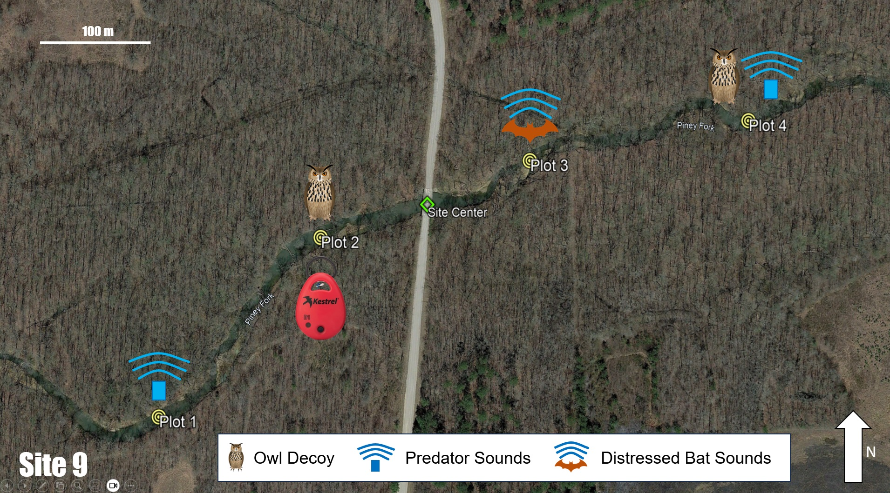

```{r setup, include=FALSE}

library(tidyverse)
library(ggplot2)
library(dplyr)
library(tidyr)
library(knitr)      
library(leaflet)
library(hexbin)
library(readxl)
library(viridis)
library(knitr)
library(reshape2)
library(quantreg)
library(lubridate)
library(dplyr)
library(lme4)
library(MuMIn)


pacman::p_load("leaflet","OpenStreetMap","sf","tidyverse")

```

# Predator Project Site 10



# Site Map

**Map of the training areas of Fort Campbell military installation showing the ten sampling sites for the predator project conducted during the summer of 2023.**

```{r map1, echo=FALSE, message=FALSE, warning=FALSE}

fortcampbell <- openmap(c(36.6503,-87.7176),
                     c(36.5278,-87.4892), type='bing')

campbell <- openproj(fortcampbell, projection = "+proj=longlat +ellps=WGS84 +units=m +no_defs")

samplepoints <- read.csv("gulley_sampling_loc.csv")

point_color = c("red", "blue", "green", "orange", "purple", "lightblue", "gray", "pink", "brown", "white")

autoplot.OpenStreetMap(campbell) +
  geom_point(data=samplepoints, aes(x=long, y=lat, color=point_color), size = 2, alpha = 0.8) +
  geom_text(data=samplepoints, aes(x = long, y = lat,label = site), color="white", vjust=-1, size=4.01, nudge_x = -.005, nudge_y = -.0055, fontface="bold") +
  labs(x = "Longitude", y = "Latitude", title = "Sampling Sites for the 2023 Fort Campbell Predator Project") +
  guides(color = FALSE)

```

# Map with Trial Information

**Interactive map of the training areas showing trial information for each site and the dates that the site was sampled.**

``` {r map2, echo=FALSE, include=TRUE}

leaflet(samplepoints) %>% 
  addTiles() %>% 
  addMarkers(popup = samplepoints$trial,
             lng = samplepoints$long, 
             lat = samplepoints$lat)

```